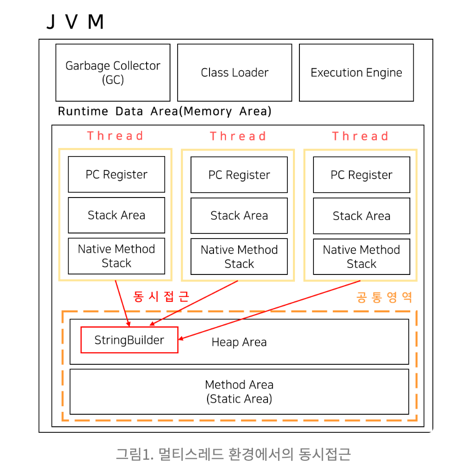

# StringBuilder vs StringBuffer

- 문자열 관련 프로그래밍에서는 `String` 을 사용해야 한다.
- But `String` 을 여러번 바뀌는 문자열을 위해 사용하는 것은 좋지 않다.
  - Why?
- 이유는 `String` 은 내부 `value` 값이 `final` 로 선언 되어 있는 `불변 객체` 이다.
``` java
public final class String
    implements java.io.Serializable, Comparable<String>, CharSequence {

    /**
     * The value is used for character storage.
     *
     * @implNote This field is trusted by the VM, and is a subject to
     * constant folding if String instance is constant. Overwriting this
     * field after construction will cause problems.
     *
     * Additionally, it is marked with {@link Stable} to trust the contents
     * of the array. No other facility in JDK provides this functionality (yet).
     * {@link Stable} is safe here, because value is never null.
     */
    @Stable
    private final byte[] value;
```
- 값을 바꾸기 위해서는 새로운 객체에 할당 해주어야 해서 비용이 크다.
- 값 비싼 String 보다 `StringBuilder` 와 `StringBuffer` 의 사용으로 비용 절감을 실현 해보자.
``` java
String stringWorld = StringBuilder("String");
stringWorld.append("World");
String string = stringWorld.toString()
```
``` java
String stringWorld = StringBuffer("String");
stringWorld.append("World");
String string = stringWorld.toString()
```
- 두 결과는 같다.
---
## 그렇다면 왜? StringBuilder 와 StringBuffer 로 클래스를 나누었는가...

> 스레드 안정성의 처리를 위함이다.    
> StringBuilder, StringBuffer 내부에서 append 가 가능하다는 것은 가변 객체라는 뜻이다.   
> 멀티스레드 환경에서 가변 객체는 동시 접근이 가능하여 안전하지 않다.   
> 멀티스레드 환경에서 가변 객체의 동시 접근을 허용하면, 여러 스레드가 같은 객체를 동시에 변경 가능하여 서로 다른 데이터로 변환이 되어 데이터의 일관성이 깨진다.



- Java 에서는 이를 해결하기 위해서 메서드 제어자에 `synchronized` 를 붙일 수 있다.
- `synchronized` 제어자는 멀티스레드 환경에서 메서드에 한번에 하나의 스레드만 접근을 허용하는 제어자이다.
- 하나의 스레드가 메서드 내부의 연산을 돌리고 있을 경우 lock 을 잡아 다른 스레드가 접근을 불가능하게 만든다.

```java
// StringBuilder append
@Override
public StringBuilder append(String str) {
    super.append(str);
    return this;
}
```

```java
// StringBuffer append
@Override
public synchronized StringBuffer append(String str) {
    toStringCache = null;
    super.append(str);
    return this;
}
```

### 그래서 둘의 차이는?
- `synchronized` 제어자의 차이!
- 기본적으로 `StringBuffer` 의 모든 메서드에는 `Synchronized` 가 붙어있다.
- `StringBuffer` 은 멀티스레드 환경에서 안전한 연산을 수행할 수 있는 클래스이며,
- `StringBuilder` 클래스는 멀티스레드 환경에서 안전하지 않은 클래스이다.

### 요약
- 변하지 않는 값은 `String` 이 가장 좋다. 재할당 연산을 하지 않는다면 멀티 스레드에도 끄떡없다.
- 변하는 값에 대해서는 동시 접근이 가능한 환경(멀티 스레드 환경)에서는 `StringBuffer` 을 사용하는 것이 좋다.
- 동시 접근이 가능하지 않은 환경에서는 StringBuilder 을 사용하는 것이 좋다.
  - 왜?
  - `StringBuffer` 사용 시 lock 을 잡아 비용이 들기 때문이다.

